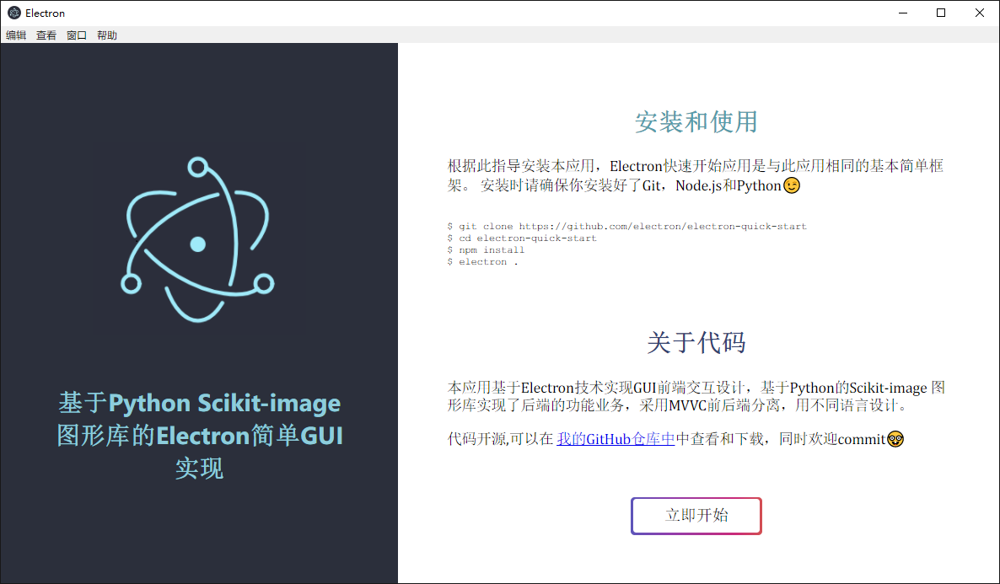
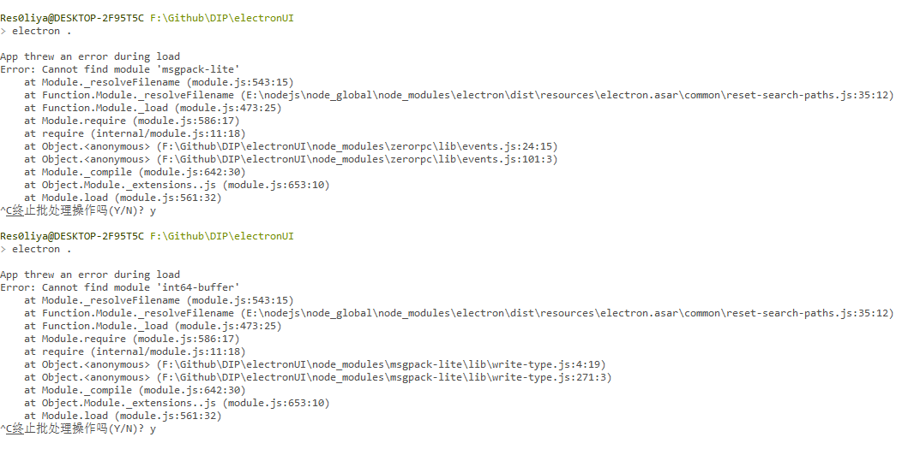
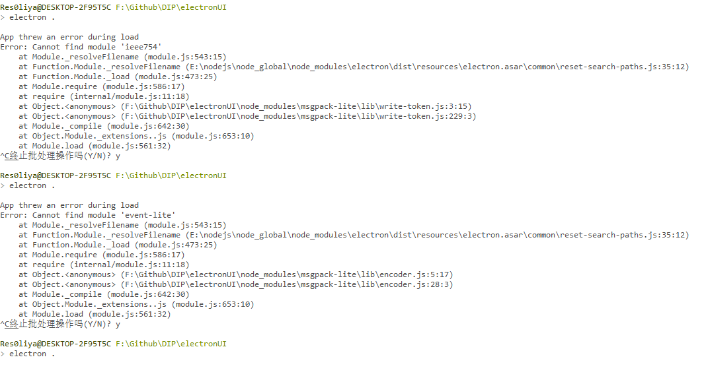
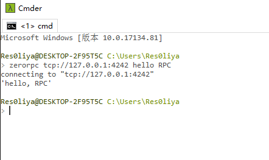

# DIP
数字图像处理大作业，根据数字图像处理课上讲的一些内容,进行一个简单的实现吧
基本上是调用scimage的API了

## 技术栈

1. pillow 似乎scimage包含pillow里边的功能啊, 放弃pillow了
2. **scikit-image** scimage(针对我需要实现的简单功能来说, 是一个很全面的数字图像处理包
3. openCV 看心情
4. electron 用作GUI

## 放个about图

## zeroRPC

Have been spending three days on **zeroRPC**
          using both ubuntu(can't find zeroRPC) and windows(DDL Error) platform

The problem is in the **zeroMQ** I think
Maybe ubuntu's approach can get over this Error

Solving:

Using [electron-python-example](https://github.com/fyears/electron-python-example)

1. The zeroRPC configuration is in the **package.json**
2. The author commits on the **zeroRPC** reposity

### 解决方案

用了一种比较 **投机取巧** 的方法
git clone了electron-python-example这个项目的代码拿到本地，发现作者的代码能够保证zerorpc的正常运行
然后将项目包里的node_modules中的zerorpc包和zeromq包copy到本项目的node_modules中

>该作者在官方0rpc/zerorpc-node仓库的基础上update了一下，[fyears/zerorpc-node](https://github.com/fyears/zerorpc-node)可以尝试一下

然后通过不断检查缺失的包依次又补进了四个module，然后确认zerorpc有用了

+ msgpack-lite
+ int64-buffer
+ ieee754
+ event-lite

## menu设计

- 文件
    - 打开图片
    - 转化为灰度图
    - 保存图片
- 增强
    - 直方图修正
    - 灰度图增强
    - 彩色图增强
    - 低通滤波
    - 高通滤波
    - 同态滤波

- 变换
    - 旋转平移
    - 拉伸（调整尺寸）
    - 放大
    - 缩小

- 边缘检测
    - sobel
    - laplace
    - prewitt
    - roberts
- 高级
    - 图像复原
    - 图像分割
    - 图像压缩

## 需求抽离

1. 图像增强 空域增强 -> pillow

    - [x] 直方图修正(绘制, 均衡化)和均衡化
    - [x] 彩色增强
    - [x] 平滑和锐化处理

2. 图像增强 频域操作

    - [ ] 低通滤波
    - [ ] 高通滤波
    - [ ] 同态滤波

3. 图像操作

    - [ ] 旋转平移
    - [ ] 拉伸(调整尺寸)
    - [ ] 放大缩小

4. 边缘检测算子

    - [x] Sobel
    - [x] Laplace
    - [x] Prewitt
    - [x] Roberts

5. 高级

    - [x] 图像复原
    - [x] 图像分割
    - [ ] 图像压缩